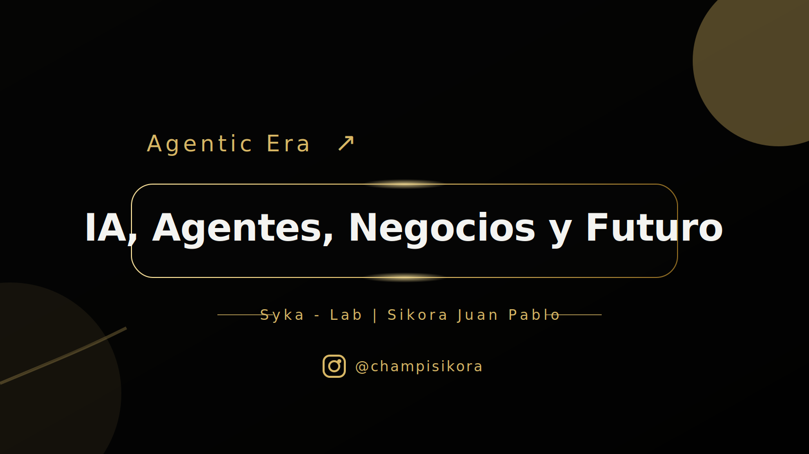

  

 

---

## About

I build AI-powered systems for creators, consultants, digital businesses and **PyMEs**.

My focus is turning messy operations into usable systems: AI agents, automation workflows, CRM logic, second-brain structures and content infrastructure.

> **Construyendo sistemas, no solo contenido.**

---

## Core Direction

<table>
<tr>
<td align="center" width="33%"><b>AI Agents</b> workflows and assistants for real business execution</td>
<td align="center" width="33%"><b>Business Systems</b> CRM logic, operator dashboards and internal tooling</td>
<td align="center" width="33%"><b>Second Brain</b> Obsidian-based memory systems for humans and agents</td>
</tr>
</table>

---

## Featured Public Builds

<table>
<tr>
<td width="50%" valign="top">
<h3>Hermes + Obsidian Setup Consultant</h3>

Hermes skill for designing and connecting Obsidian as a second brain and memory layer for AI agents.

<a href="https://github.com/SikJa/hermes-obsidian-setup-consultant">Open repository →</a>
</td>
<td width="50%" valign="top">
<h3>Remotion + Graphify Setup Wizard</h3>

Setup wizard around Remotion and Graphify for AI-assisted content infrastructure experiments.

<a href="https://github.com/SikJa/remotion-graphify-setup-wizard">Open repository →</a>
</td>
</tr>
</table>

---

## Analytics

---

## Stack & Tools

  

